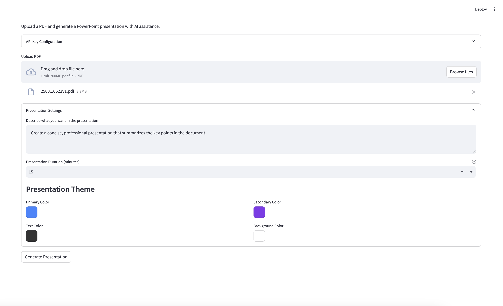
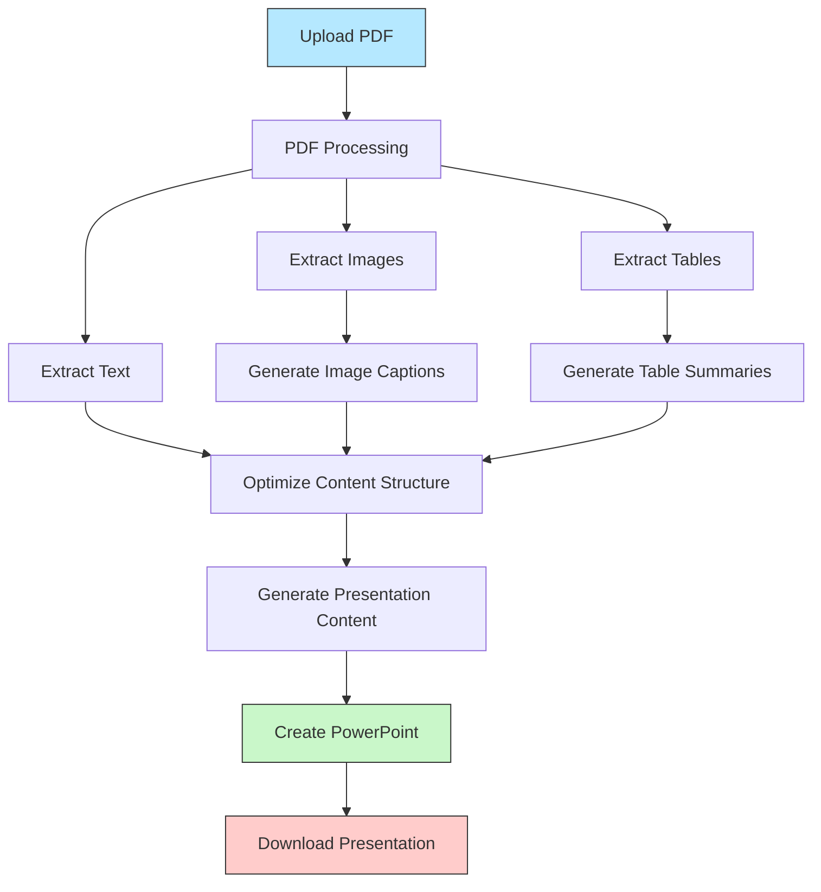

# StreamSlide

StreamSlide is an AI-powered tool that transforms PDF documents into professional PowerPoint presentations with minimal effort. Leveraging Google's Gemini API, it automatically extracts content, captions images, and generates structured presentations. Users can provide customized prompts to tailor the presentation exactly to their needs - whether that's using only specific sections of a PDF, adjusting titles, or setting a target presentation duration to optimize content density.



## Features

- **PDF Processing**: Extracts both text and images from PDF documents
- **AI Image Captioning**: Uses Gemini Vision to generate relevant captions for images
- **Smart Content Generation**: Creates coherent presentation content based on document context
- **Custom PowerPoint Creation**: Builds professional slides with appropriate text and image placement
- **Presentation Time Optimization**: Adjusts content density based on specified presentation duration
- **Customizable Themes**: Personalize your presentation with color theme options
- **User-Friendly Interface**: Simple Streamlit interface with progress tracking
- **API Key Management**: Use environment variables or enter your API key directly
- **Customizable Prompts**: Specify exactly what content you want included or emphasized from your PDF
- **Flexible Content Selection**: Choose to use the entire document or focus on specific sections

## Demo

Check out the demo folder for sample PDF documents and their generated PowerPoint presentations:

- Sample PDF files in [demo/sample_pdfs/](/demo/sample_pdfs/)
- Generated presentations in [demo/sample_presentations/](/demo/sample_presentations/)

## Installation

### Prerequisites

- Python 3.8+
- Google Gemini API key ([Get one here](https://ai.google.dev/))

### Setup

1. Clone the repository:

   ```bash
   git clone https://github.com/xuhuizhan5/StreamSlide.git
   cd StreamSlide
   ```
2. Create a virtual environment:

   ```bash
   python -m venv venv
   ```
3. Activate the virtual environment:

   - Windows:
     ```bash
     venv\Scripts\activate
     ```
   - macOS/Linux:
     ```bash
     source venv/bin/activate
     ```
4. Install dependencies:

   ```bash
   pip install streamlit google-generativeai langchain langchain-community pypdf python-pptx Pillow python-dotenv PyMuPDF requests docling pandas
   ```
5. (Optional) Create a .env file with your Gemini API key:

   ```bash
   echo "GEMINI_API_KEY=your_api_key_here" > .env
   ```

## Usage

1. Start the application:

   ```bash
   streamlit run app.py
   ```
2. Access the application in your web browser (typically at http://localhost:8501)
3. Enter your Gemini API key if not already set in the .env file
4. Upload a PDF document
5. Configure presentation settings:

   - Write a customized prompt describing what you want in the presentation (specific sections, title adjustments, etc.)
   - Set presentation duration (minutes) to optimize content density
   - Customize color theme
6. Click "Generate Presentation" and watch the magic happen
7. Download your professionally created PowerPoint presentation

## Workflow



## How It Works

StreamSlide processes your PDF in five key steps:

1. **PDF Processing**: Extracts text, images, and tables from the uploaded PDF
2. **Image Analysis**: Uses Gemini Vision to understand and caption each image
3. **Content Generation**: Creates presentation structure and content based on the document and presentation time
4. **Slide Creation**: Builds PowerPoint slides with appropriate layouts for different content types
5. **Presentation Assembly**: Combines everything into a downloadable PowerPoint file with your selected theme

## Project Structure

```
StreamSlide/
│
├── app.py                  # Main application file
├── .env                    # Environment variables (optional)
├── README.md               # Project documentation
├── requirements.txt        # Python dependencies
│
├── demo/                   # Demo materials
│   ├── UI_demo.png         # Screenshot of the interface
│   ├── sample_pdfs/        # Example PDF documents
│   └── sample_presentations/ # Generated presentations
│
├── temp_files/             # Temporary processing files
│   └── images/             # Extracted images
│   └── tables/             # Extracted tables
│
└── output/                 # Generated PowerPoint files
```

## Configuration Options

### Gemini Model Selection

By default, StreamSlide uses the `gemini-1.5-flash` model which is available on the free tier. You can modify this in `app.py` by changing the `GEMINI_MODEL` constant:

```python
# Current default (free tier)
GEMINI_MODEL = "gemini-1.5-flash"

# For potentially better performance (may have usage caps)
# GEMINI_MODEL = "gemini-1.5-pro"
```

Pro models generally offer better performance but come with stricter usage caps on the free tier. If you have a paid Google AI Studio account, you might want to switch to the Pro model for enhanced results.

## Requirements

- streamlit
- google-generativeai
- langchain
- langchain-community
- python-pptx
- Pillow
- python-dotenv
- PyMuPDF
- requests
- docling
- pandas

## Limitations

- Processing large PDFs may take time and consume API tokens
- Complex images may receive generic captions
- The free tier of Gemini API has rate limits
- Only supports PDF files as input
- Table formatting in PowerPoint is simplified
- Free-tier Gemini models may have lower quality output than Pro models

## Contributing

Contributions are welcome! Please feel free to submit a Pull Request.

1. Fork the repository
2. Create your feature branch (`git checkout -b feature/amazing-feature`)
3. Commit your changes (`git commit -m 'Add some amazing feature'`)
4. Push to the branch (`git push origin feature/amazing-feature`)
5. Open a Pull Request

## License

This project is licensed under the MIT License - see the LICENSE file for details.

## Acknowledgments

- Google Gemini for AI capabilities
- Streamlit for the interactive web interface
- PyMuPDF for PDF processing
- python-pptx for PowerPoint generation
- Docling for document processing assistance
